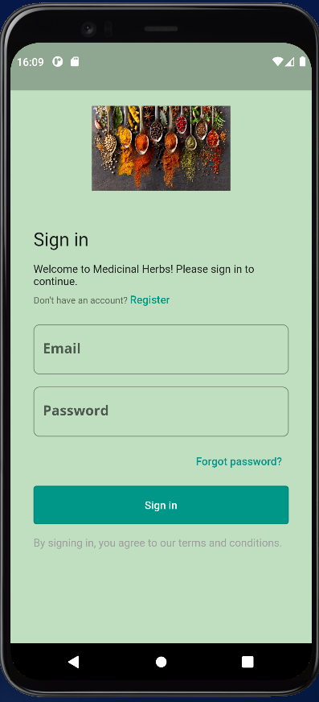
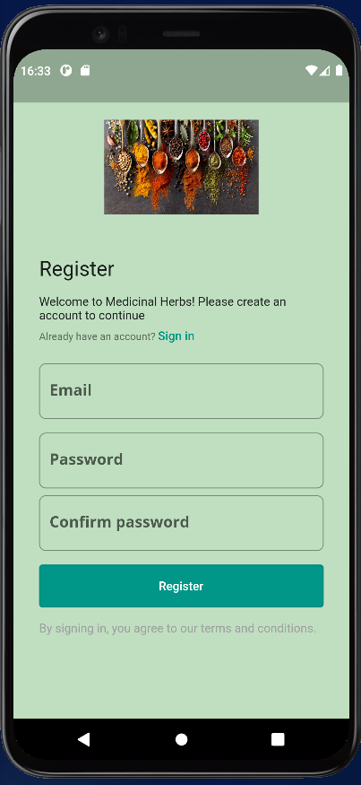
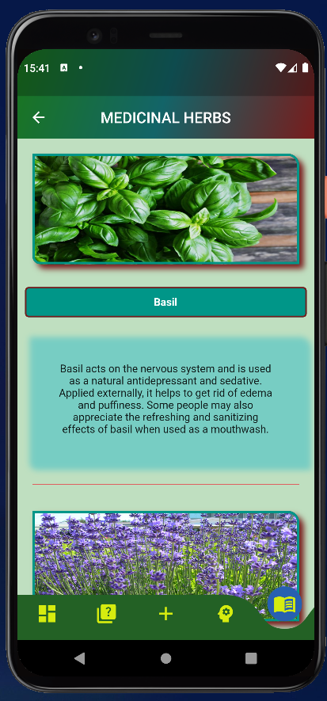
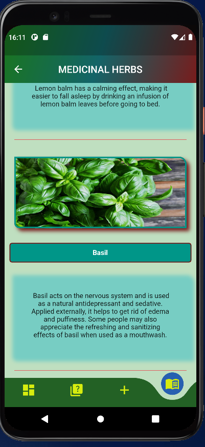
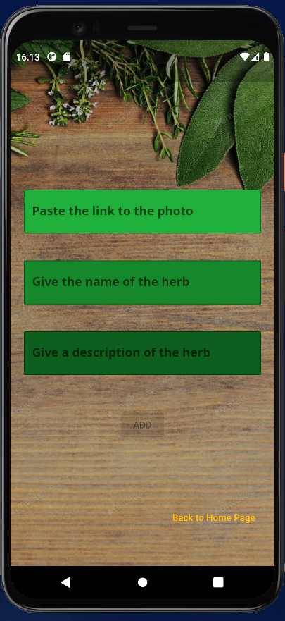
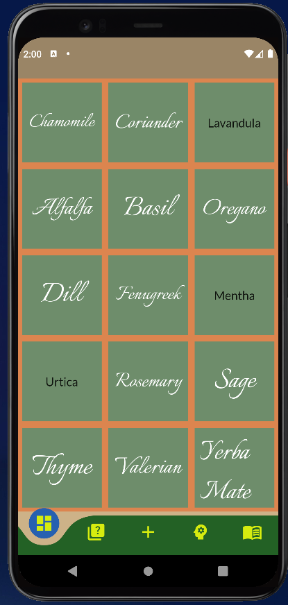
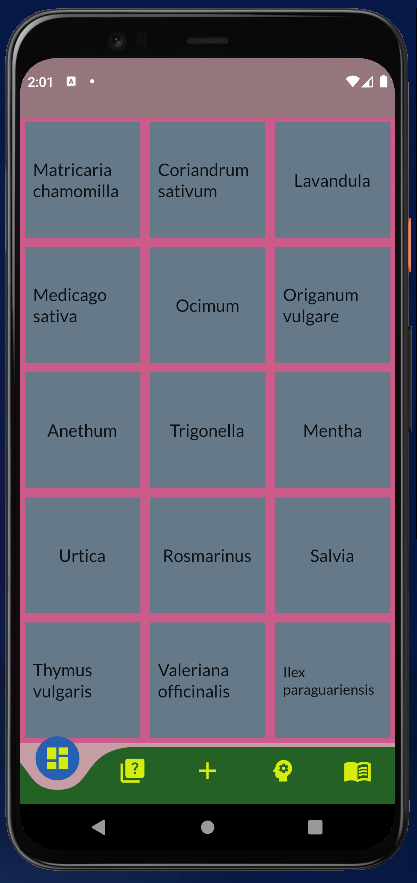
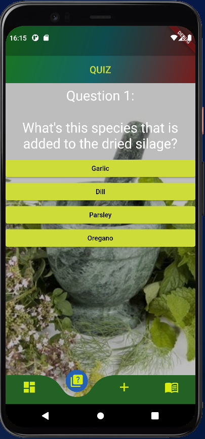
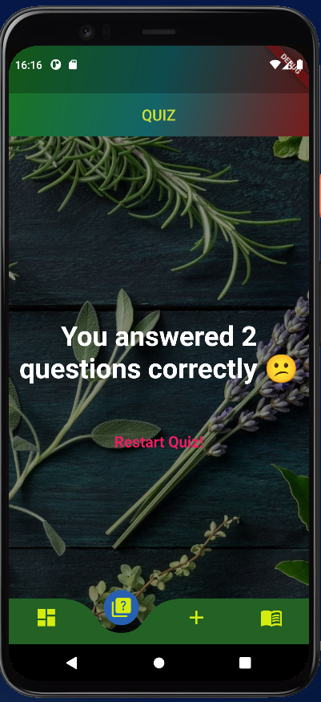

# medicinal_herbs

Welcome to the application about Medicinal Herbs!  

👉This app will help you learn medicinal herbs.

👉You can add herbs to your library, play flashcards, and take a quiz.

✅Flashcards will teach you the Latin names of herbs.

✅In the quiz you will test your knowledge of the properties of herbs.

✅In the herbal library you will be able to add photos and descriptions of the herbs of your choice.

Home Page:

         

Herbal Library:

         

Flashcards:

      

Quiz:

       
 
